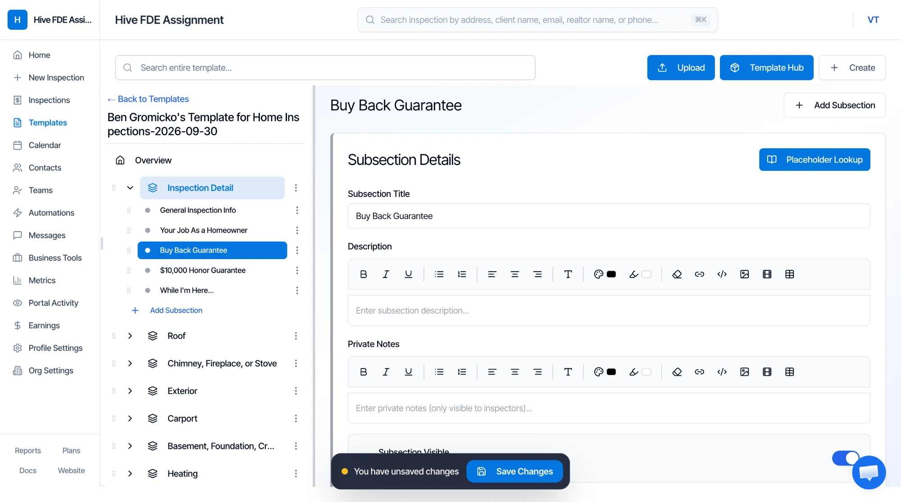
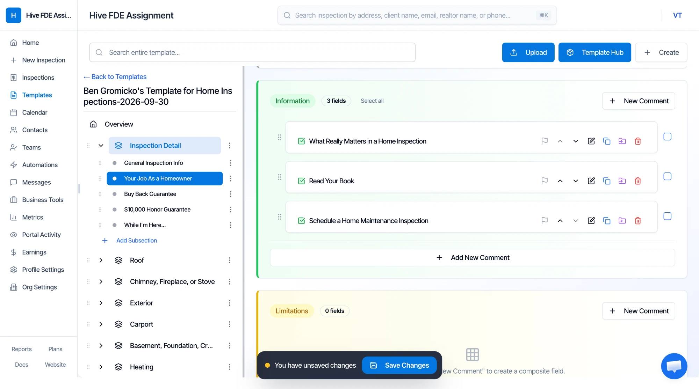
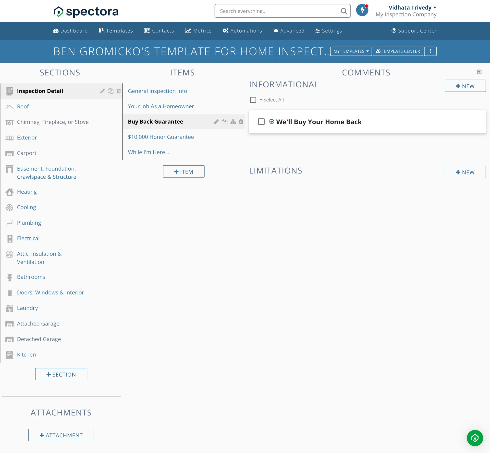
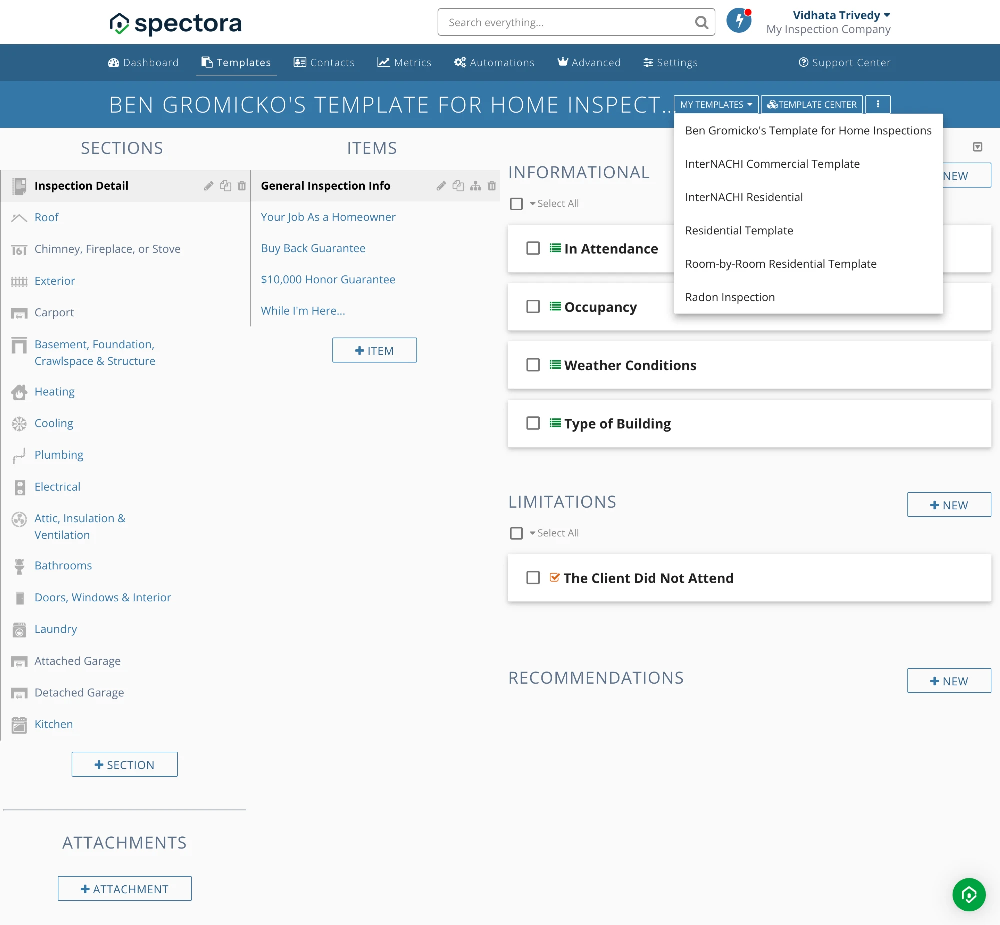

# How Spectora and Hive model a template (UI walkthrough)

Observed in trial accounts on 2026-09-30. This is reference material for designing our editor and mapping. Importer-specific behaviour is in `hive-importer-findings.md`.

## Spectora template editor

Three-column layout: **Sections | Items | Comments**. Section and item rows have edit, duplicate, reorder and delete icons. Comments are shown in three stacked groups with a "+ New" button each: **Informational**, **Limitations**, and a third group labelled **Recommendations/Deficiencies**. Comment rows show an icon for the answer type (list = checkbox/multiple choice, `#` = number, check = boolean). Template-level **Attachments** sit under the section list. The ⋮ menu has Template Settings, Template Tools, Add Templates, **Export to spreadsheet**, Copy template settings, Share, Template Center, Delete, Undelete.

| Entity | Fields in the create/edit modal |
|---|---|
| Section | Name (required), Hide Overview Grid, Optional/Included, Icon, Standards of Practice (rich text), Reminders (rich text) |
| Item | Name (required), Info Item (no ratings/defects/grid row), Optional/Included, Reminders (rich text) |
| Comment | Answer Format (e.g. "Checkbox (Yes/No, Present/Not Present)"), Name (required), Default Location, Default Text (rich text: bold/italic/underline, colour, lists, align, link, image, video, table, code view), "Generate using AI" |
| Attachment | Name, file (PDF, text, Word, Excel, PowerPoint, images, audio), Display as Report |

A new section is created with a default empty item "General".

## Hive template editor

Two panes: a tree on the left (**Overview → Sections → Subsections**, drag handles, ⋮ menus, "+ Add Subsection", "+ Add Section") and a detail editor on the right. Top bar: search the entire template, **Upload** (import), **Template Hub**, **Create**. A persistent "You have unsaved changes / Save Changes" bar suggests explicit save.

- **Overview:** counters (Sections / Subsections / Fields), Template Settings (name, per-subsection Ratings toggle with customisable names/abbreviations/colours), Customer's Info (customer viewing name, …), Template Tools.
- **Section:** Title, Description (rich text), Private Notes (inspector-only), Section Visible toggle.
- **Subsection** (= Spectora Item): Title, Description, Private Notes, Subsection Visible, "Placeholder Lookup". Below: three field groups with counts, **Information**, **Limitations**, **Defects/Deficiencies**, each with "+ New Comment". Rows have flag, move up/down, edit, duplicate, move-to, delete and a bulk-select checkbox.
- **Field types** seen in edit dialogs: *Text* (text input; Description rich text; Default Value rich text), *Checkbox Item* (checkbox with label; "Auto-select this comment"), *Defect/Deficiency* ("recommendation" kind; Category **Maintenance Items / Recommendations / Safety Concerns**; Service dropdown, e.g. "Qualified Professional"). All have "Generate description" (AI), Attach Images (up to 20; JPEG/PNG/GIF/WebP, 10 MB each), "Auto-flag (Required comment)".
- **Import dialog:** source Spectora / HIP (Home Inspector Pro) / HomeGauge / Horizon (Carson Dunlop); "Special PDF templates can not be imported"; chat-bubble offer of a free assisted import; file drop; **"Import cost estimates"** opt-in.

## Mapping between the two

| Spectora | Hive | Ours (see `GLOSSARY.md`) |
|---|---|---|
| Section | Section | Section |
| Item | Subsection | Item |
| Comment | Field / Comment | Comment |
| Comment type info / limit / defect | Information / Limitations / Defects-Deficiencies | Comment type |
| Category -1 / 0 / 1 | Maintenance Items / Recommendations / Safety Concerns | Category |
| Recommendation slug (`pro`) | Service ("Qualified Professional") | Recommendation |
| Answer type boolean + Default `true` | Checkbox Item + Auto-select | Answer type + default |
| Standards of Practice | Section Description (probably) | missing from export |
| Reminders | Private Notes (probably) | missing from export |

## Screenshots

Hive, subsection detail editor (tree left, detail right, explicit Save bar):

Hive, comment groups (Information / Limitations / Defects) inside a subsection:

Spectora, three-column editor (Sections | Items | Comments grouped by type), the layout we adopt:

Spectora, "My Templates" switcher:

